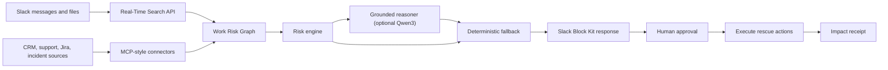
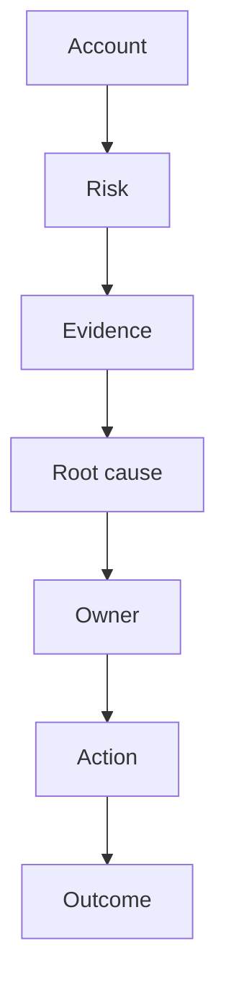

# Architecture

## Product Loop



## Live Evidence Path

RescueOps has two evidence lanes:

1. Live Slack RTS lane: `rescueops/rts_search.py` calls `assistant.search.info` for capability checks and `assistant.search.context` for account-specific search.
2. Deterministic fallback lane: `data/demo_workspace.json` keeps the demo reliable when Slack credentials or RTS access are unavailable.

Both lanes feed the same `RescueCase` pipeline, so the Slack card, score explanation, owner plan, rescue room, and impact receipt are generated from the evidence returned at scan time.

## Work Risk Graph



## Runtime Components

- `rescueops/rts_search.py` verifies and queries Slack Real-Time Search, then converts live Slack snippets into evidence.
- `rescueops/evidence_provider.py` chooses seeded, RTS, hybrid, or MCP-enriched evidence modes.
- `rescueops/mcp_client.py` and `rescueops/mcp_business_server.py` add CRM, support, Jira, and incident-style business context through MCP.
- `rescueops/signal_discovery.py` mines repeated phrases from the current evidence set so workspace-specific patterns can appear in the score explanation and Slack AI brief.
- `rescueops/risk_engine.py` turns current evidence into score components, root causes, owners, rescue actions, and impact metrics.
- `rescueops/rescue_policy.py` loads policy-driven owner mappings, due dates, and action templates from `data/rescue_policy.json`.
- `rescueops/rescue_reasoner.py` optionally calls a local Qwen3/OpenAI-compatible reasoning model to rewrite case briefs, rescue plans, owner updates, and customer-safe updates from grounded `RescueCase` JSON. Guardrails strip reasoning traces and reject unsupported money claims before posting to Slack.
- `rescueops/slack_ai_agent.py` handles Slack AI assistant prompts and app-mention briefs, forwarding Slack event `action_token` into the RTS path.
- `rescueops/socket_app.py` executes the Slack workflow through `/rescueops`, Block Kit buttons, channel creation, and message posting.

## Commands

```text
/rescueops rts-check
/rescueops scan acme
/rescueops live acme
/rescueops demo acme
```

`/rescueops scan acme` and `/rescueops live acme` run the RTS lane by default and display the evidence source on the Slack card. `/rescueops demo acme` is the named deterministic fallback. `/rescueops hybrid acme` is an optional comparison mode.
