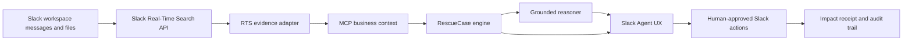
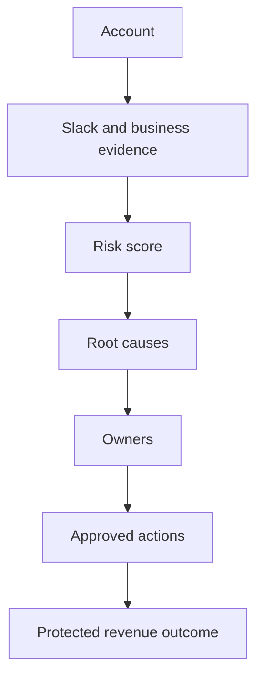

# Architecture

## Product Loop



## Live Evidence Path

RescueOps uses Slack Real-Time Search as the primary evidence path:

1. Capability check: `rescueops/rts_search.py` calls `assistant.search.info` through `/rescueops rts-check`.
2. Live evidence scan: `/rescueops scan <account>` and `/rescueops live <account>` call `assistant.search.context` and convert live Slack snippets into weighted evidence.
3. Business enrichment: when `RESCUEOPS_USE_MCP=1`, `rescueops/mcp_client.py` calls the local MCP server for CRM, support, incident, and ownership context.
4. Demo fallback: `data/demo_workspace.json` is used only for tests, `/rescueops demo`, or when Slack credentials/access are unavailable.

All evidence lanes feed the same `RescueCase` pipeline, so the Slack card, score explanation, owner plan, rescue room, customer-safe update, and impact receipt are generated from the evidence returned at scan time.

## Work Risk Graph



## Runtime Components

- `rescueops/rts_search.py` verifies Slack Real-Time Search with `assistant.search.info`, queries live Slack evidence with `assistant.search.context`, and converts returned snippets into evidence.
- `rescueops/evidence_provider.py` chooses live RTS, demo, hybrid, or MCP-enriched evidence modes.
- `rescueops/mcp_client.py` and `rescueops/mcp_business_server.py` implement the MCP server integration for CRM, support, Jira, and incident-style business context.
- `rescueops/signal_discovery.py` mines repeated phrases from the current evidence set so workspace-specific patterns appear in score explanations and Slack AI briefs.
- `rescueops/risk_engine.py` turns current evidence into score components, root causes, owners, rescue actions, and impact metrics.
- `rescueops/rescue_policy.py` loads policy-driven owner mappings, due dates, and action templates from `data/rescue_policy.json`.
- `rescueops/rescue_reasoner.py` optionally calls a local Qwen3/OpenAI-compatible reasoning model to rewrite case briefs, rescue plans, owner updates, and customer-safe updates from grounded `RescueCase` JSON. Guardrails strip reasoning traces and reject unsupported money claims before posting to Slack.
- `rescueops/slack_ai_agent.py` handles Slack AI assistant prompts and app-mention briefs, forwarding Slack event `action_token` into the RTS path when Slack provides it.
- `rescueops/socket_app.py` executes the Slack workflow through `/rescueops`, Block Kit buttons, channel creation, and message posting.

## Commands

```text
/rescueops rts-check
/rescueops scan acme
/rescueops live acme
/rescueops demo acme
```

`/rescueops rts-check` proves Slack RTS availability. `/rescueops scan acme` and `/rescueops live acme` run the live RTS lane and display the evidence source on the Slack card. `/rescueops demo acme` is the named deterministic fallback. `/rescueops hybrid acme` is an optional comparison mode.